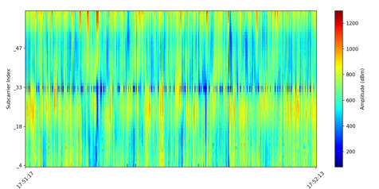
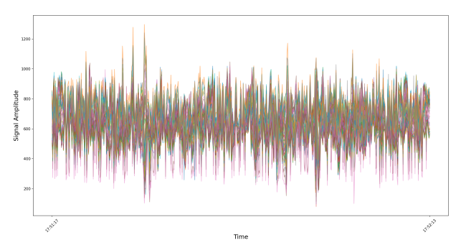
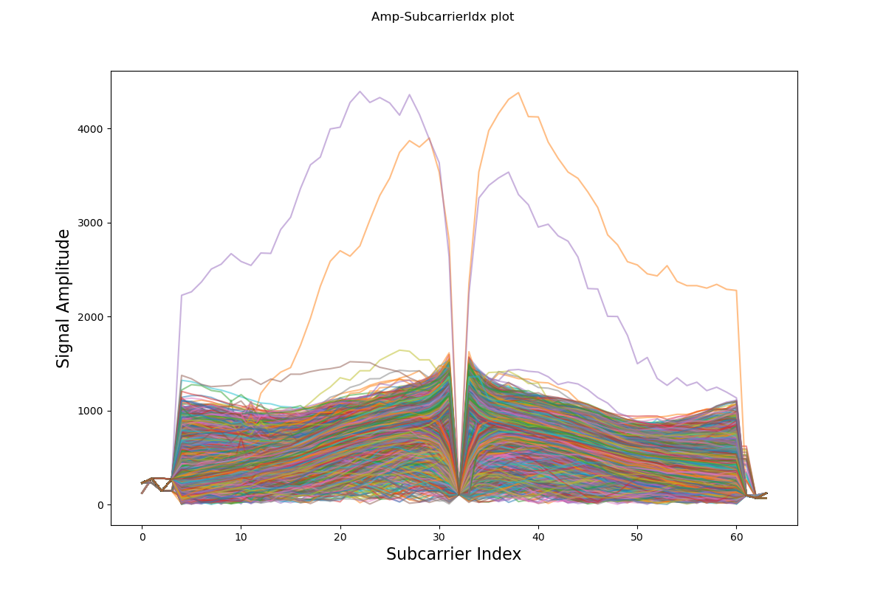

# CSI Visualization with Python

📊 Channel State Information(CSI) visualization with python

## Before use
This repo is based on CSI extracted with [Nexmon CSI Extractor](https://github.com/seemoo-lab/nexmon_csi)(Raspberry Pi, Wi-Fi chip: bcm43455c0).  
Therefore, in order to use real-time plot and collect data for visualization, the Nexmon CSI extractor installation must be preceded.  
(**The data collection repo will be updated soon**)

## Installation

* Clone this repo and install the dependencies
```
pip install -r requirements.txt
```
* If you want to use real-time plotter, clone this repo to the Raspberry Pi with Nexmon firmware installed.

## Usage

```
python csiexplorer.py [CSI dir] --plt [Plot Type]
```
* Use sample data for Amplitude-PacketIdx plot
```
python csiexplorer.py sample --plt 1
```
* Use real-time Amplitude or Phase plot
> After installing the Nexmon firmware on the Raspberry Pi and setting the monitoring mode, run the code below.
```
sudo python3 csi_realTimeAmp.py
or
sudo python3 csi_realTimePhase.py
```

CSI explore
-----
1. Heatmap (Amplitude-Time)



2. Amplitude-Time



3. Amplitude-SubcarrierIdx (all packet)



4.Amplitude-SubcarrierIdx Flow (single antenna set)


Real-Time Amplitude plot
-----


